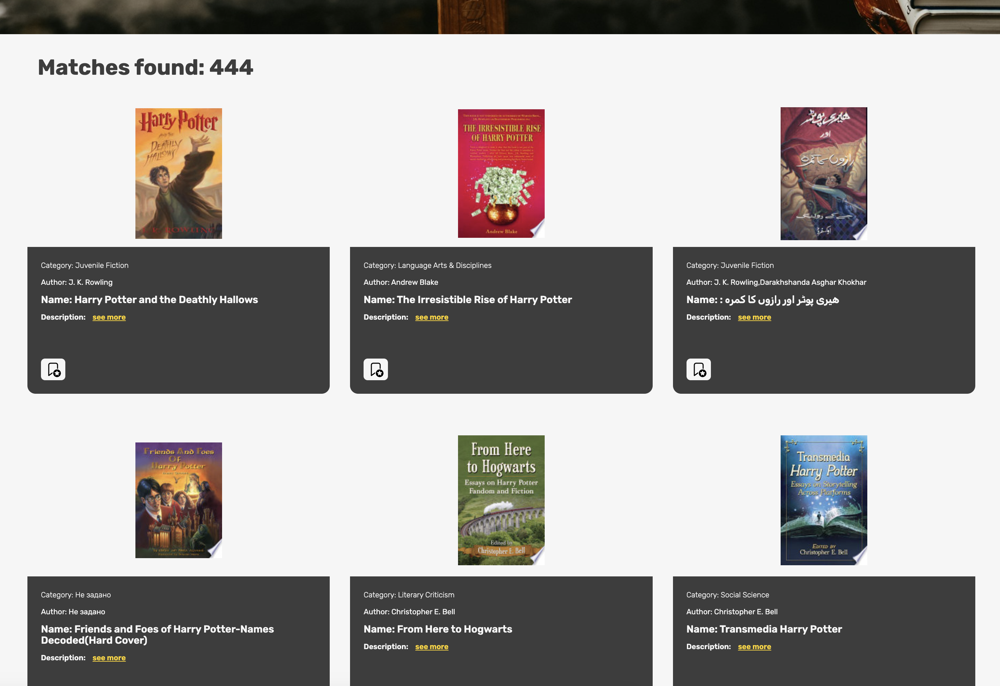
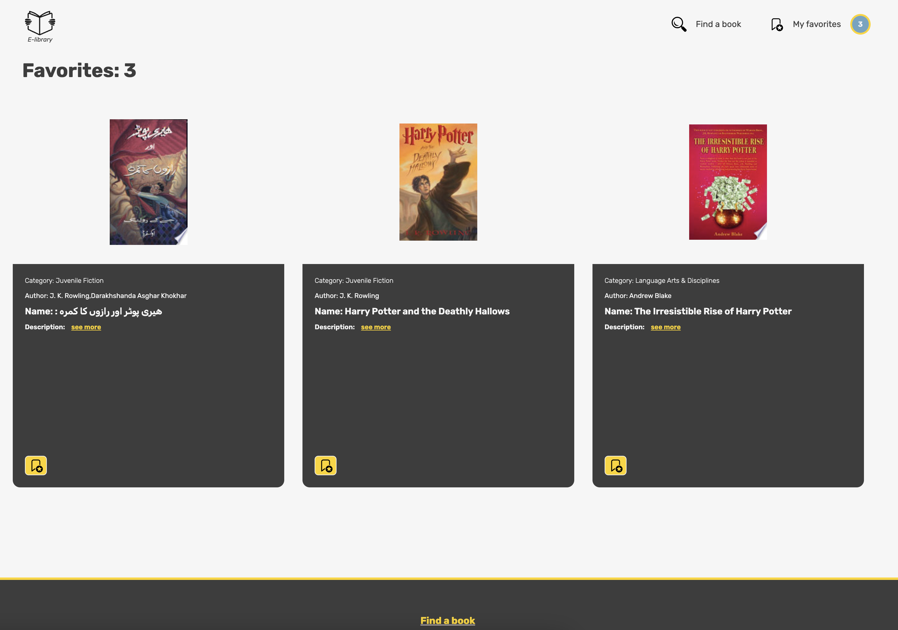
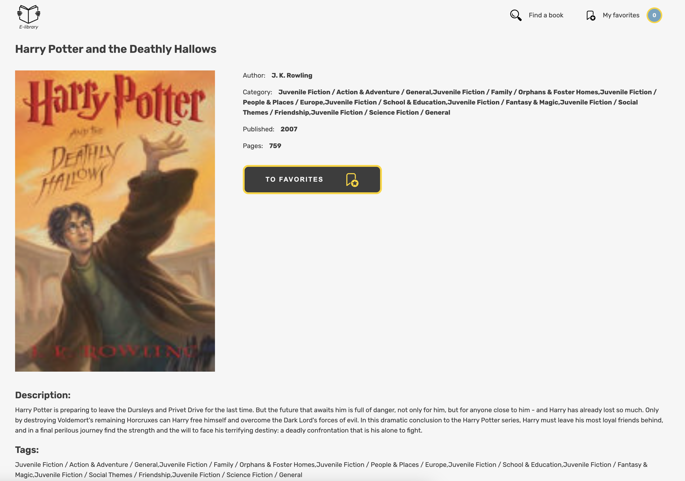

<h1 align="center" id="title">Book Library Application</h1>

<p id="description">Book Library Application - это небольшое веб-приложение (Single Page Application), реализованное на чистом Javascript и классах (ООП).
Представляет собой библиотеку книг с возможностью поиска интересующей литературы посредством предоставленного Google Books APIs функционала.
</p>






<br />

## :toolbox: Шаги по установке

1. Убедиться, что у Вас установлен **Git** и **NodeJS**.
2. Клонировать репозиторий на свой компьютер.
3. Создать `.env` файл в основной директории.
4. Заполнить `.env` файл содержимым:

```bash
# .env

# GOOGLE BOOKS APIs
GOOGLE_API_KEY=<your-google-api-publishable-key>
GOOGLE_BOOKS_API_URL=<https://www.googleapis.com/books/v1/volumes>

```

5. Откройте терминал в основной директории. Установите зависимости при помощи консольной команды `npm install`.

6. Теперь приложение полностью настроено 👍 и Вы можете начать его использовать, запустив консольную команду `npm run dev`.

<h2>💻 Стек технологий:</h2>

<ul>
    <li>Vanilla Javascript (классы, ООП), библиотека Оn-change</li>
</ul>
